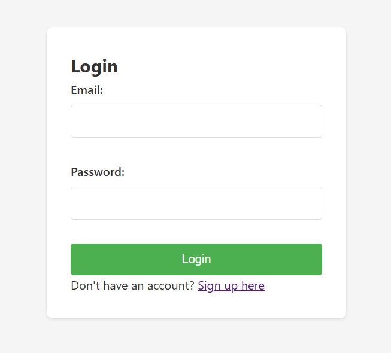
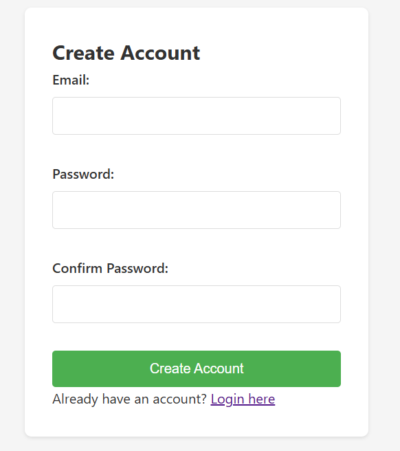
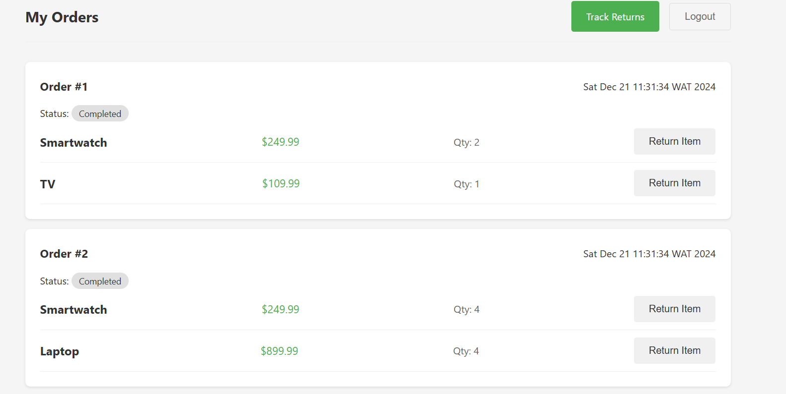
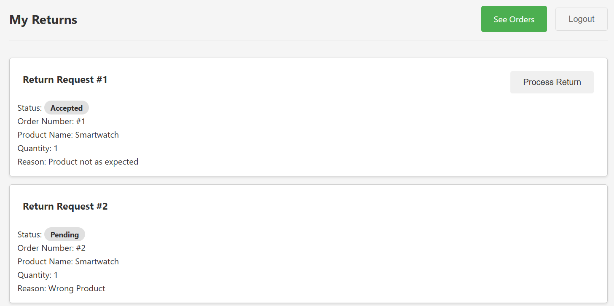
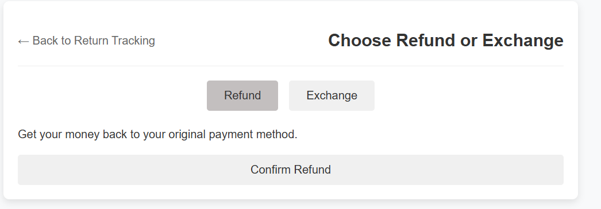
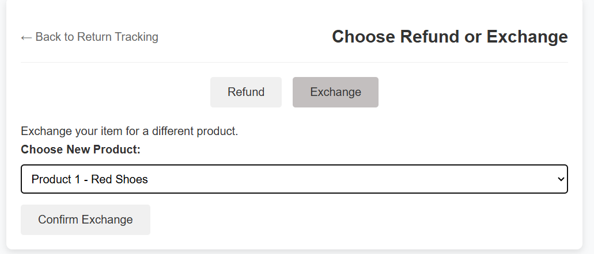

# Return Orders Management System

## Overview

The **Return Orders Management System** is a web-based application designed for handling order returns and refunds in e-commerce platforms. It allows users to manage their order history, initiate returns, track the status of returns, and handle refunds. The system utilizes Remote Method Invocation (RMI) for efficient communication between the client and the backend services, ensuring smooth interactions for both customers and administrators.

---

## Key Features

- **User Authentication**: Secure login and registration system for users.
<p align="center">
  
  
</p>


- **Order History**: View a list of past orders.


- **Return Management**: Initiate and track returns for purchased products.

- **Return Tracking**: Track the current status of your return requests, including approval, processing, and completed stages.
- 
- **Refund Processing**: Process and manage refunds for returned items.
<p align="center">
  
  
</p>


- **Session Management**: User session handling to maintain logged-in status.
  
---

## Tools and Technologies

- **Java**: Core programming language for backend logic and service implementation.
- **JEE (Java Enterprise Edition)**: Used for building the web application with Servlets and JSP.
- **RMI (Remote Method Invocation)**: Handles communication between the client and server for return management.
- **Servlets & JSP**: Used to manage HTTP requests, responses, and user interfaces.
- **Tomcat 9.0**: Application server for deploying the Java-based web application.
- **Eclipse**: Integrated Development Environment (IDE) for coding and debugging.
- **MySQL** (Optional): Can be used for database management and storage of user, order, return, and refund data (if required).

---

## Installation

### Prerequisites

Before setting up the project, ensure the following are installed:

- Java Development Kit (JDK) 8 or later
- Apache Tomcat 9.0 or later
- Eclipse IDE
### Setup

1. **Clone the Repository**

   ```bash
   https://github.com/KcMelek/Return-Orders-Management-System.git
   
2. **Configure RetoursArticlesRMI**:
   - Run the project as a Java Application, Make sure it is running locally on `localhost:1099`.

3. **Compile and Run RetoursArticles**:
   - Use Eclipse to build and run the project on server Tomcat.
   - Access the application through `http://localhost:8085/RetourArticles`.

## Usage

1. **Access the Application**:
   - Once the application is running on Tomcat, open your web browser and navigate to `http://localhost:8085/RetourArticles`.
   - The login page will appear, where you can either log in with an existing account or register a new one.

2. **Registering a New User**:
   - On the login page, click on the "Register" link to create a new account.
   - Provide the required details such as email, password, and confirm your password to complete the registration.

3. **Login to the Application**:
   - Enter your email and password to log in.
   - Upon successful login, you will be redirected to the orders page, where you can see your previous orders.

4. **Managing Orders**:
   - In the orders page, you can view all your past orders.
   - If you need to initiate a return, you can select an order and initiate a return for specific products. You can also provide a return reason.
  
5. **Managing Your Return Requests**:
   - Track and manage the status of your return requests.
   - View details about each return, including the return status and the associated products.

6. **View Refund Status**:
   - After processing a return, the application will show the refund status (if applicable). Refunds are automatically processed after returns are accepted.

## Contributing

1. Fork the repository.
2. Create a feature branch (`git checkout -b feature-branch`).
3. Commit your changes (`git commit -am 'Add new feature'`).
4. Push to the branch (`git push origin feature-branch`).
5. Create a new Pull Request.

## License

This project is licensed under the MIT License - see the [LICENSE](LICENSE.md) file for details.
